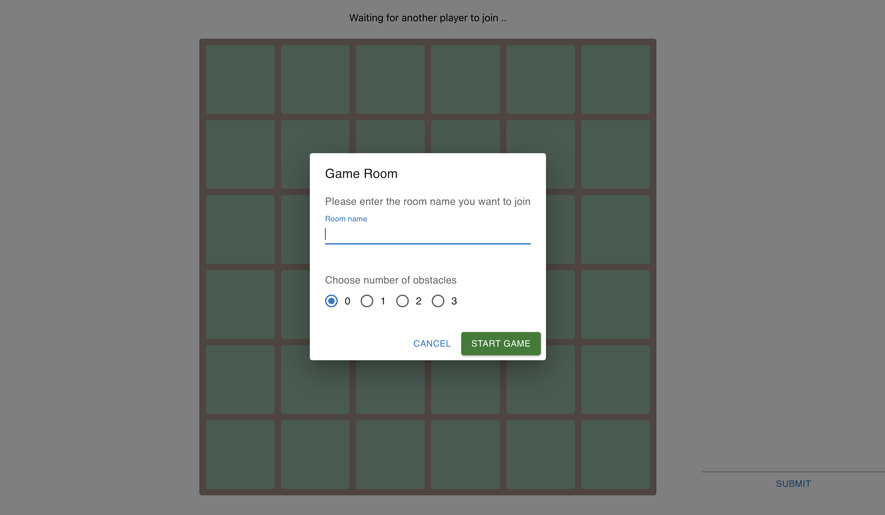
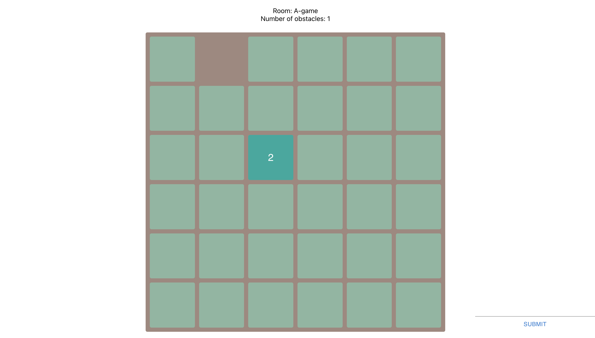
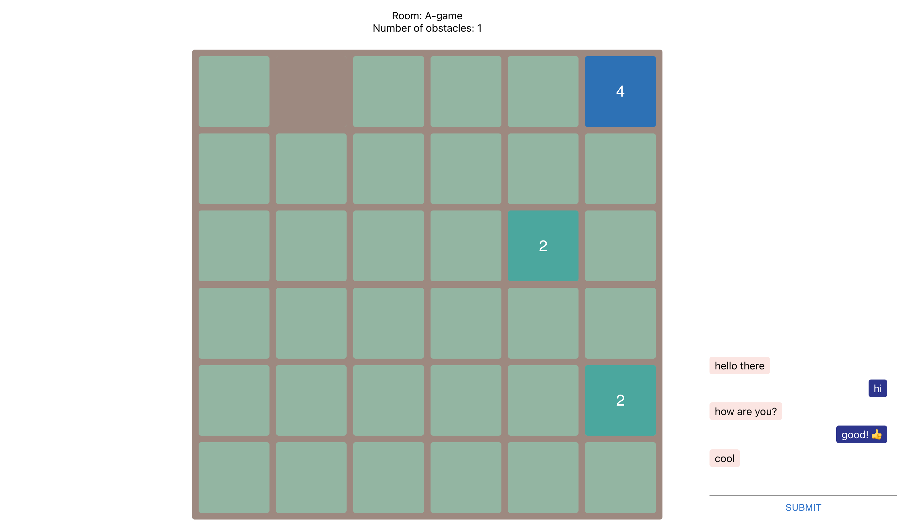

## 2048 game made with React, Typescript and SocketIO

### Specifications
- The grid consists of 6x6 tiles
- At the beginning of a game the grid is empty, except for one tile of value 2 placed at
random.
- The user can slide the tiles either up, down, left or right
- After each slide a new tile with value 1 will appear in a random free space.
- If there is no free space to put the new tile the game is lost
- During the slide, tiles of equal values pushed into each other will merge into a new
tile with the combined value. 2 + 2 = 4
- If there are 3 values next to each other, e.g. 2 2 2, and the player slides right,
the values closest to the wall should merge first resulting in 2 4.

- If any tile reaches the value 2048 the game is won.

### Feature
- [x] 2 players
- [x] Chat between players
- [x] With obstacles

### Demo

1. User join room and choose number of obstacles


2. Start game


3. Chat 



### Installation

1. Start frontend 
```
cd frontend
npm install
npm start
```

2. Start backend
```
cd backend
npm install
npm start
```